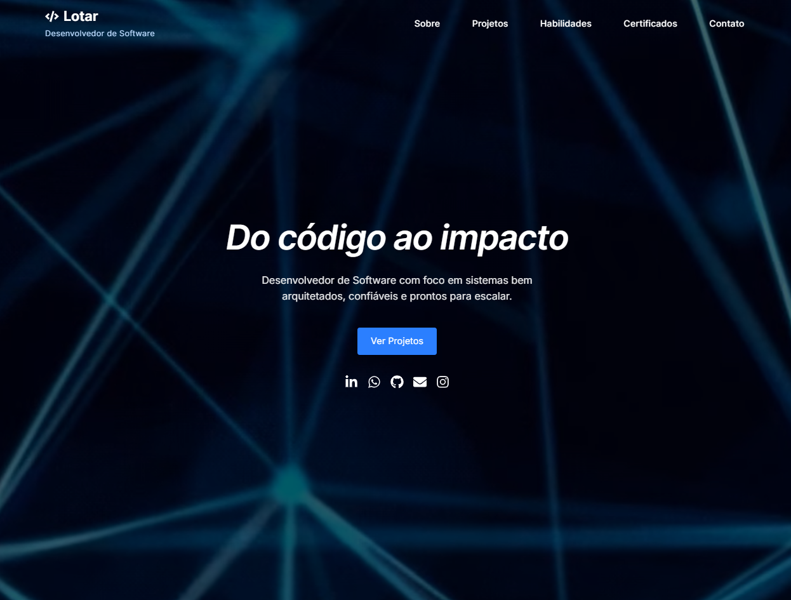

## 📘 website | Lucas Lotar

Este é o repositório do meu website profissional como Desenvolvedor de Software. O projeto foi desenvolvido com foco em performance, organização e boas práticas de desenvolvimento frontend. Aqui apresento minhas habilidades, projetos, certificações e formas de contato de forma clara, responsiva e atrativa.

---

### 🔗 Acesse online

📍 [lotar.dev.br](https://lotar.dev.br)

---

### 🛠️ Tecnologias e Ferramentas

- **[React](https://reactjs.org/)** + **[TypeScript](https://www.typescriptlang.org/)**
- **[Tailwind CSS](https://tailwindcss.com/)** para estilização moderna e responsiva
- **[Framer Motion](https://www.framer.com/motion/)** para animações suaves
- **[React Icons](https://react-icons.github.io/react-icons/)** para uso de ícones
- **Hospedado** na AWS

---

### 📌 Funcionalidades

- ✅ Seção "Sobre mim" com detalhes técnicos e objetivos profissionais
- ✅ Cards interativos de projetos com tecnologias, status e links
- ✅ Filtro por categorias de habilidades técnicas
- ✅ Certificados organizados visualmente
- ✅ Animações com `Framer Motion` nas transições
- ✅ Design 100% responsivo
- ✅ Ícones sociais com links diretos (LinkedIn, GitHub, Email, WhatsApp)

---

### 📷 Preview



---

### 🚀 Como rodar localmente

```bash
# Clone o repositório
git clone https://github.com/Lotar-lucas/portfolio.git

# Acesse a pasta do projeto
cd portfolio

# Instale as dependências
npm install

# Rode o servidor de desenvolvimento
npm run dev
```

Acesse no navegador: `http://localhost:3000`

---

### 📁 Estrutura do Projeto

```
src/
├── assets/              # Imagens e logos
├── components/          # Componentes reutilizáveis (Header, Footer, etc.)
├── helpers/             # Auxiliares
├── styles/              # Arquivos de estilos globais
├── App.tsx              # Componente raiz
├── main.tsx             # Ponto de entrada da aplicação React
└── index.css            # Arquivos de estilos globais
```

### 📄 Licença

Este projeto é de uso pessoal e tem fins de apresentação profissional.
Você pode se inspirar, mas evite cópias diretas sem autorização.
